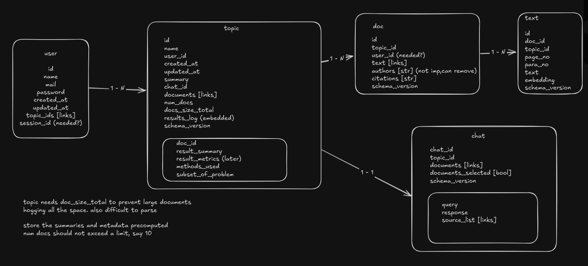

# Data model for Research assistant

Based on the required data for each entity and proposed access pattern, an initial data model has been built as follows:

## Collections:

### 1. User
Stores info of users registering onto the app. Useful only for the hosted version, local version will be based on single user access.

### 2. Topic
Topics are the research topics on which papers are being collected for analysis. Users group papers into topics, which are then used to provide analysis on the topic as a whole. Mixing papers of different topics is a bad idea, logically speaking, due to mixing of concerns.

### 3. Documents
A document is a pdf file of the paper that is to be analyzed uploaded to the system under a specific topic. This needs to be broken down in the ingestion pipeline and stored for retrieval and other downstream tasks such as search, question answering, structured info generation.

### 4. Text
Part of text from the document. Chunks are created in order to break down to smaller ideas, which leads to better semantic search. Each document contains the full text, vector embedding along with metadata on the text for reference.

### 5. Chat
Chat on documents inside a topic, question answering with source citations.